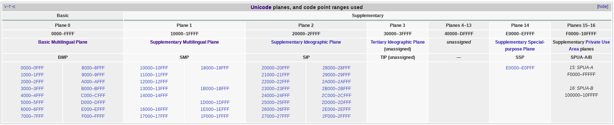

# 第二回 Unicode-Math视角

<!-- TOC -->

- [1. Coded Character Set](#1-coded-character-set)
  - [1.1. Concepts](#11-concepts)
  - [1.2. Unicode](#12-unicode)
  - [1.3. Unicode Core](#13-unicode-core)
- [2. Unicode Concepts](#2-unicode-concepts)
  - [2.1. Code Point](#21-code-point)
  - [2.2. Code Block](#22-code-block)
  - [2.3. Code Plane](#23-code-plane)
  - [2.4. Code Space](#24-code-space)
- [3. Unicode Encoding](#3-unicode-encoding)
- [4. 总结](#4-%E6%80%BB%E7%BB%93)

<!-- /TOC -->

**Character Set**是属于“文化”的范畴，**Coded Character Set**是属于“数学”的范畴，**Character Encoding**是属于“计算机”的范畴。

## 1. Coded Character Set

### 1.1. Concepts

**Coded Character Set**: A character set in which each character has an assigned integral number.

**Code Point**: An integral number assigned to a character in a coded character set.

### 1.2. Unicode

**Unicode**: A **coded character set** that contains all characters used in the written languages of the world and special symbols. As of Unicode 6.1, introduced in January, 2012, Unicode code point values have a range from `0x0000` to `0x10FFFF`.

### 1.3. Unicode Core

Unicode是属于一种**Coded Character Set**，因此它最本质的概念就是建立Character与Code Point之间的映射。

> 作者有话说：Code Point（点）-->Code Block（块）-->Code Plane（面）-->Code Space（空间），概念在不断的变大

## 2. Unicode Concepts

讲解思路：一群人相当于Code Point，这群人住在大楼里，这些大楼相当于Code Block，由这许多的大楼组成了一个区，相当于Plane，再由这些区组成了一个城市，相当于Unicode。

### 2.1. Code Point

In character encoding terminology, a **code point** or **code position** is any of the numerical values that make up the code space.

举一些例子

| Character | Code Point | Unicode Name              |
| --------- | ---------- | ------------------------- |
| `A`       | `0x41`     | LATIN CAPITAL LETTER A    |
| `a`       | `0x61`     | LATIN SMALL LETTER A      |
| ` `       | `0xFEFF`   | ZERO WIDTH NO-BREAK SPACE |
| `�`       | `0xFFFD`   | REPLACEMENT CHARACTER     |

### 2.2. Code Block

- [Unicode block](https://en.wikipedia.org/wiki/Unicode_block)

In Unicode, a **block** is defined as **one contiguous range** of **code points**. Blocks are named uniquely and have no overlap. They have a starting code point of the form `hhh0` and an ending code point of the form `hhhF`.

举一些例子：

| Block Range     | Block Name                  | Code Points | Assigned Characters | Memo             |
| --------------- | --------------------------- | ----------- | ------------------- | ---------------- |
| `0x0000~0x007F` | Basic Latin                 | `128`       | `128`               |                  |
| `0x4E00~0x9FFF` | CJK Unified Ideographs      | `20992`     | `20976`             | 是常用的中文字符    |
| `0xD800~0xDB7F` | High Surrogates             | `896`       | `0`                 |                  |
| `0xDB80~0xDBFF` | High Private Use Surrogates | `128`       | `0`                 |                  |
| `0xDC00~0xDFFF` | Low Surrogates              | `1024`      | `0`                 |                  |

There are 1024 "high" surrogates (`D800`～`DBFF`) and 1024 "low" surrogates (`DC00`～`DFFF`). By combining a pair of surrogates, the remaining characters in all the other planes can be addressed (`1024 × 1024 = 1048576` code points in the other 16 planes).

> 1024 × 1024 = 1048576  
> 256 × 4 × 256 × 4 = 65536 × 16 = 1048576  
> 896:128 = (896/64):(128/64) = 14:2

Since **high surrogate values** in the range `DB80`~`DBFF` always produce values in the **Private Use planes**, the high surrogate range can be further divided into (normal) **high surrogates** (`D800`~`DB7F`) and "**high private use surrogates**" (`DB80`~`DBFF`).

### 2.3. Code Plane

In the Unicode standard, a **plane** is a continuous group of 65,536 (216) code points. There are 17 planes, identified by the numbers 0 to 16. **Plane 0** is the **Basic Multilingual Plane (BMP)**, which contains most commonly-used characters. The higher planes 1 through 16 are called "**supplementary planes**". The very last code point in Unicode is the last code point in plane 16, U+10FFFF. As of Unicode version 12.0, six of the planes have assigned code points (characters), and four are named.

The **Unicode codespace** is divided into seventeen **planes**, numbered `0` to `16`:

| Plane         | Range          | Name                                   | Abbr     |
| ------------- | -------------- | -------------------------------------- | -------- |
| `Plane 0`     | `0000-FFFF`    | Basic Multilingual Plane               | BMP      |
| `Plane 1`     | `10000-1FFFF`  | Supplementary Multilingual Plane       | SMP      |
| `Plane 2`     | `20000-2FFFF`  | Supplementary Ideographic Plane        | SIP      |
| `Plane 3`     | `30000-3FFFF`  | Tertiary Ideographic Plane             | TIP      |
| `Plane 4-13`  | `40000-DFFFF`  | unassigned                             | -        |
| `Plane 14`    | `E0000-EFFFF`  | Supplement­ary Special-purpose Plane   | SSP      |
| `Plane 15-16` | `F0000-10FFFF` | Supplement­ary Private Use Area planes | SPUA-A/B |

### 2.4. Code Space

> **code space** (or **codespace**), the range of code points.

Unicode defines a codespace of `1,114,112` code points in the range `0x0000` to `0x10FFFF`.

> 0x10FFFF = 1114111

## 3. Unicode Encoding

**Unicode** can be implemented by different **character encodings**. The **Unicode standard** defines `UTF-8`, `UTF-16`, and `UTF-32`, and several other encodings are in use. The most commonly used encodings are `UTF-8`, `UTF-16`, and `UCS-2`, a precursor of `UTF-16`.

`UTF-8`, the dominant encoding on the **World Wide Web** (used in over 92% of websites), uses one byte for the first 128 code points, and up to 4 bytes for other characters. The first 128 Unicode code points are the ASCII characters, which means that any ASCII text is also a UTF-8 text.

`UCS-2` uses two bytes (16 bits) for each character but can only encode the first 65,536 code points, the so-called **Basic Multilingual Plane (BMP)**. With 1,114,112 code points on 17 planes being possible, and with over 137,000 code points defined so far, `UCS-2` is only able to represent less than half of all encoded Unicode characters. Therefore, `UCS-2` is outdated, though still widely used in software. `UTF-16` extends UCS-2, by using the same 16-bit encoding as UCS-2 for the **Basic Multilingual Plane**, and a 4-byte encoding for the other planes. As long as it contains no code points in the reserved range `U+D800`–`U+DFFF`, a UCS-2 text is a valid UTF-16 text.

`UTF-32` (also referred to as UCS-4) uses four bytes for each character. Like `UCS-2`, the number of bytes per character is fixed, facilitating character indexing; but unlike `UCS-2`, `UTF-32` is able to encode all Unicode code points. However, because each character uses four bytes, UTF-32 takes significantly more space than other encodings, and is not widely used.

- UTF-16BE - Every Unicode character is mapped to a sequence of 2 or 4 bytes with the most significant byte listed first.
- UTF-16LE - Same as UTF-16BE, except that the least significant byte is listed first.
- UTF-8 - Every Unicode character is mapped to a sequence of 1, 2, 3 or 4 byte.

## 4. 总结

首先，介绍了Coded Character Set和Code Point的概念。关于Coded Character Set和Character Set这两个概念，严格的来说，它们并不相同。两个概念，在学习的时候，要注意区分，目的是学习知识；在使用的时候，可以认为两个概念是一回事，都表示经过编码后的字符集合，这是为了方便与“外行人”的交流。之所以称之为“外行人”，一种原因是因为他可能不知道这两者之间的差别，另一种原因就是虽然他知道，但是他关心的角度不同。一旦你发现一个人在明确的使用“Coded Character Set”，你可以放心的假设他是一个“内行人”了。严格的来说，Unicode是属于Coded Character Set的类别。Unicode的核心就是建立Character和Code Point之间的映射。

接着，介绍了Unicode中4个从小到大的概念：Code Point、Code Block、Code Plane 和 Code Space。这4个概念，可以将作一个类比：将Code Point理解为“一个居民”，将Code Block理解为“一栋楼”，将Code Plane理解为“一个区”，将Code Space理解为“一个城市”。

最后，Unicode作为一个Coded Character Set，它有不同的Character Encoding的方式。其中，最常用的Unicode编码方式就是`UTF-8`和`UTF-16`。

参考：

- [Unicode](https://en.wikipedia.org/wiki/Unicode)
- [Plane (Unicode)](https://en.wikipedia.org/wiki/Plane_(Unicode))
- [Unicode block](https://en.wikipedia.org/wiki/Unicode_block)
- [Code point](https://en.wikipedia.org/wiki/Code_point)
- [CJK Unified Ideographs (Unicode block)](https://en.wikipedia.org/wiki/CJK_Unified_Ideographs_(Unicode_block))
