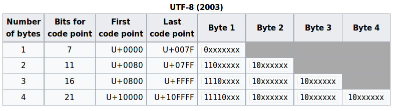

# UTF8

UTF-8 is a **multi-byte encoding system**. It has the nice property that for ordinary `ASCII` (`0x00` to `0x7F`) it encodes identically to `ASCII`.



## BOM

While there is obviously no need for a **byte order signature** when using UTF-8, there are occasions when processes convert UTF-16 or UTF-32 data containing a byte order mark into UTF-8. When represented in UTF-8, the byte order mark turns into the byte sequence. Its usage at the beginning of a UTF-8 data stream is neither **required** nor **recommended** by the **Unicode Standard**, but its presence does not affect conformance to the UTF-8 encoding scheme. Identification of the byte sequence at the beginning of a data stream can, however, be taken as a near-certain indication that the data stream is using the UTF-8 encoding scheme.

## UTF-8 Encoding Algorithm

This section provides a tutorial example on how to write a programming algorithm to encode **characters** with UTF-8 encoding.

Here is an algorithm for UTF-8 encoding on a single character:

```txt
Input:
   unsigned integer c - the code point of the character to be encoded
Output:
   byte b1, b2, b3, b4 - the encoded sequence of bytes
Algorithm:
   if (c<0x80)
      b1 = c>>0  & 0x7F | 0x00
      b2 = null
      b3 = null
      b4 = null
   else if (c<0x0800)
      b1 = c>>6  & 0x1F | 0xC0
      b2 = c>>0  & 0x3F | 0x80
      b3 = null
      b4 = null
   else if (c<0x010000)
      b1 = c>>12 & 0x0F | 0xE0
      b2 = c>>6  & 0x3F | 0x80
      b3 = c>>0  & 0x3F | 0x80
      b4 = null
   else if (c<0x110000)
      b1 = c>>18 & 0x07 | 0xF0
      b2 = c>>12 & 0x3F | 0x80
      b3 = c>>6  & 0x3F | 0x80
      b4 = c>>0  & 0x3F | 0x80
   end if
```

**Exercise**: Write an algorithm to decode a UTF-8 encoded byte sequence.

